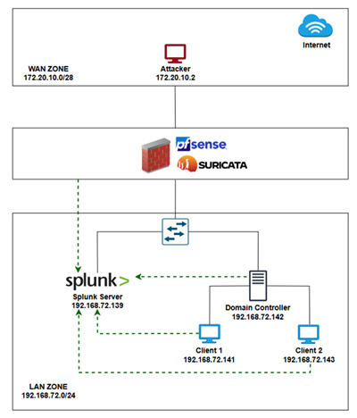

## Implementation of Splunk in an Intrusion Detection System Combining pfSense and Suricata

### Network layout
|Machine|IP|Gateway|OS|
|-|-|-|-|
|Attacker|172.20.10.2|172.20.10.8|Kali Linux 2024.3|
|pfSense|172.20.10.8 & 192.168.72.5||pfSense CE 2.6.0 (FreeBSD 12.3)|
|Splunk Server|192.168.72.139|192.168.72.5|Ubuntu Server 22.04.5|
|Domain Controller|192.168.72.142|192.168.72.5|Windows Server 2022|
|Target PC 1|192.168.72.141|192.168.72.5|Windows 10|
|Target PC 2|192.168.72.143|192.168.72.5|Windows 10|

The setup consists of an isolated test network with two segments: an external network (172.20.10.0/28) containing the attacker, and an internal network (192.168.72.0/24) with the target systems. pfSense acts as the gateway and firewall between these networks.

### Scenarios

1. LAN Zone Active Directory monitoring
2. Intrusion Detection with pfSense and Suricata

Demo: https://www.youtube.com/watch?v=fE7_1jA1RXc